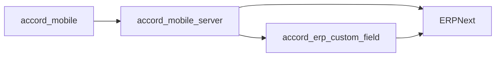

# Accord ERP Custom Field

Accord ERP Custom Field is the ERPNext-side schema companion for the Accord mobile workflow. It is a small Frappe app that keeps the `Delivery Note` field structure stable so that `accord_mobile_server` can safely translate mobile actions into ERP documents without depending on ERPNext core changes.

## System Topology



The practical execution chain is:

`accord_mobile -> accord_mobile_server -> ERPNext <- accord_erp_custom_field`

## Repository Role

This repository owns the ERP schema layer for the Accord workflow.

It is responsible for:

- defining and maintaining workflow-related custom fields on `Delivery Note`
- making the visible UI status field available on the ERP form
- preserving hidden workflow fields for backend state handling
- backfilling existing records during migrate
- keeping the ERP-side contract stable for the mobile backend

It does not own mobile screens. It does not own request routing. It does not own push notification logic.

## App Identity

The Git repository is named `accord_erp_custom_field`.

The Git repository, Frappe app, and Python package name are all `accord_erp_custom_field`.

That alignment keeps the bench install name, import path, and repository identity consistent.

## Why This Repo Exists

`accord_mobile_server` depends on a specific `Delivery Note` data model.

That model requires the following fields:

- `accord_flow_state`
- `accord_customer_state`
- `accord_customer_reason`
- `accord_delivery_actor`
- `accord_status_section`
- `accord_ui_status`

Keeping those fields in a dedicated ERP app is preferable to editing ERPNext core. This keeps upgrade risk lower and makes the business contract explicit.

## Managed Delivery Note Fields

### Internal workflow fields

- `accord_flow_state`
- `accord_customer_state`
- `accord_customer_reason`
- `accord_delivery_actor`

### UI scaffolding field

- `accord_status_section`

### Visible status field

- `accord_ui_status`

Expected intent:

- internal fields remain hidden
- `accord_ui_status` remains visible and read-only
- `accord_ui_status` is placed under `Details` after `posting_time`

Expected `accord_ui_status` values:

- `pending`
- `confirm`
- `rejected`

## Behavioral Contract

The ERP-side contract is simple and strict:

- customer confirmation must not create a return document
- customer rejection must eventually result in a real ERP return flow
- workflow comments are audit history, not business truth
- business truth lives in ERP fields and ERP documents

This repository only guarantees the field layer. The mobile backend is responsible for generating the actual return document on reject.

## Hooks And Migration

Relevant files:

- `accord_erp_custom_field/hooks.py`
- `accord_erp_custom_field/install.py`
- `accord_erp_custom_field/state/delivery_note_state.py`

Hook behavior:

- `after_install` ensures the fields exist
- `after_migrate` reasserts the expected layout and backfills status values

## Install And Update

Typical bench workflow:

```bash
bench --site <site-name> install-app accord_erp_custom_field
bench --site <site-name> migrate
```

If the app is already installed, migration is still important because it revalidates field layout and keeps `accord_ui_status` in sync for existing documents.

## Verification

After installation or migration, verify:

- the custom fields exist on `Delivery Note`
- `accord_ui_status` is visible and read-only
- hidden fields are not exposed as user-facing controls
- the mobile backend can read the fields without fallback failures

## Relationship To The Other Repositories

- Mobile client: [accord_mobile](https://github.com/WIKKIwk/accord_mobile)
- Mobile backend: [accord_mobile_server](https://github.com/WIKKIwk/accord_mobile_server)

The mobile backend uses this repo as the preferred ERP-side schema anchor.
The mobile client depends on that backend contract indirectly.

## File Map

Important files:

- `accord_erp_custom_field/hooks.py`
- `accord_erp_custom_field/install.py`
- `accord_erp_custom_field/state/delivery_note_state.py`
- `accord_erp_custom_field/modules.txt`
- `pyproject.toml`

## Operational Notes

- Keep this app small and schema-focused
- Prefer field management here over editing ERPNext core
- If mobile workflow semantics change, update this README together with the backend README
